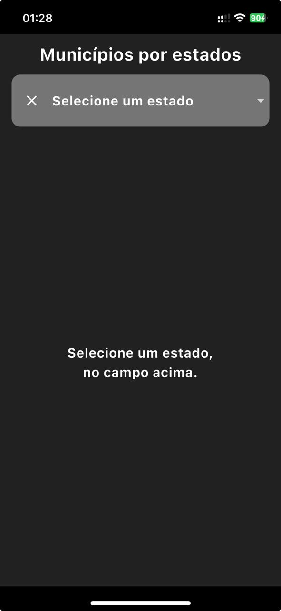
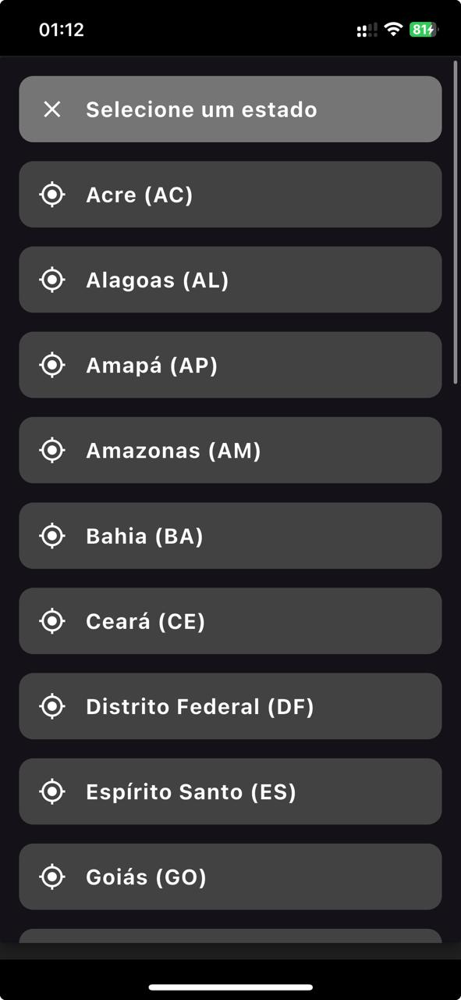
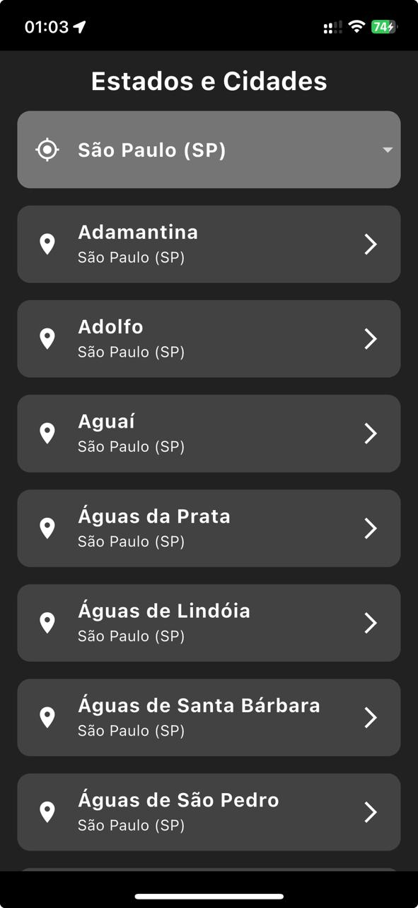
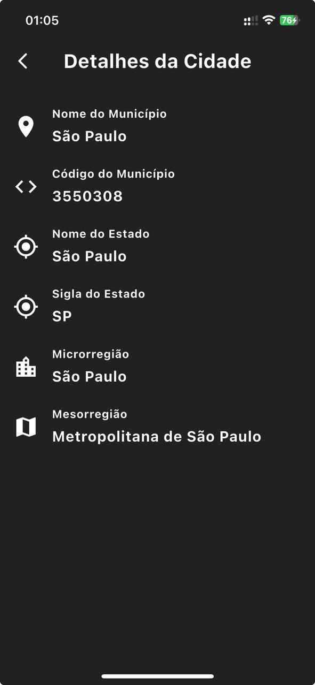

# **Lista de Municípios por Estado do Brasil**

Este é um aplicativo desenvolvido em Flutter que exibe uma lista de municípios do Brasil, organizados por estado. Os dados utilizados são oficiais do IBGE e incluem informações como código do município, nome do município, microrregião, mesorregião e estado.

## **Principais Funcionalidades**

1. **Seleção de Estado**:
   - Apresente todos os estados brasileiros em um menu dropdown organizado em ordem alfabética.
   - Permita ao usuário selecionar um estado para filtrar os municípios correspondentes.

2. **Listagem de Municípios**:
   - Exiba uma lista dos municípios do estado selecionado, ordenados alfabeticamente.
   - Ofereça navegação simples e rápida, com opção de clicar no nome do município para acessar mais informações.

3. **Detalhes do Município**:
   - Apresente informações detalhadas sobre o município, incluindo:
      - **Código do município** (código oficial do IBGE).
      - **Nome do município**.
      - **Microrregião**.
      - **Mesorregião**.
      - **Estado**.

---

## **Diferenciais Técnicos**

- **Arquitetura Clean Code Architecture**:
   - Implementação seguindo o padrão de Clean Architecture, promovendo uma separação clara entre as camadas de **Data**, **Domain** e **Presentation**.
   - Facilita a manutenção, teste e escalabilidade do aplicativo.

- **Gerenciamento de Estado com Bloc**:
   - Utilização do pacote `flutter_bloc` para gerenciar os estados do aplicativo.
   - Controle eficaz de carregamento, exibição de dados e mensagens de erro.

---

## **Tecnologias Utilizadas**

- **Flutter**: Framework de desenvolvimento multiplataforma para a criação da interface e navegação.
- **Dio**: Biblioteca para requisições HTTP, utilizada para consumir a API oficial do IBGE.
- **Provider**: Gerenciamento de dependências para injeção de serviços como data sources, repositórios e casos de uso.
- **Bloc (flutter_bloc)**: Gerenciamento de estado baseado em eventos, garantindo uma experiência fluida e controlada para o usuário.

---

## **Objetivo do Aplicativo**

O objetivo principal é fornecer uma ferramenta prática, confiável e eficiente para consultar municípios brasileiros, com dados oficiais do IBGE, atendendo a diferentes públicos, como pesquisadores, desenvolvedores, estudantes e interessados em geografia e administração pública.

---

## **Estrutura do Projeto**

- **`/lib`**: Contém o código principal do aplicativo.
   - **`/data`**: Lida com fontes de dados e repositórios.
   - **`/domain`**: Contém entidades e casos de uso.
   - **`/presentation`**: Contém controladores, estados e interfaces do usuário.
- **`/test`**: Contém o código dos testes unitários do aplicativo.
- **`pubspec.yaml`**: Arquivo de dependências do Flutter.
- **`README.md`**: Documentação do projeto.

---

## **Pré-requisitos**

Antes de começar, verifique se você possui os seguintes itens instalados no seu sistema:

1. **Flutter** na versão **3.27.1**.
2. **Dart** na versão **3.6.0** (instalado com o Flutter).
3. **Git** para clonar o repositório.
4. **Editor de Código** (recomendado: [VS Code](https://code.visualstudio.com/) ou [Android Studio](https://developer.android.com/studio)).

---

## **Instalando o Flutter 3.27.1**

### **Passos para Instalação:**

1. **Baixe o Flutter**
   - Acesse o repositório oficial do Flutter no GitHub: [https://github.com/flutter/flutter.git](https://github.com/flutter/flutter.git).
   - Clone o repositório na branch `stable`:
     ```bash
     git clone https://github.com/flutter/flutter.git -b stable
     ```
   - Certifique-se de que o diretório **`flutter`** está no `PATH` do sistema.


3. **Verifique a Instalação**
   - Execute o comando abaixo para verificar se o Flutter está instalado corretamente:
     ```bash
     flutter doctor
     ```
---

## **Clonando e Rodando o Projeto**

### **Passos para Configurar o Projeto:**


1. **Instale as Dependências**
   - Dentro do diretório do projeto, execute:
     ```bash
     flutter pub get
     ```

2. **Execute no Emulador ou Dispositivo Físico**
   - Certifique-se de que um dispositivo está conectado e listado:
     ```bash
     flutter devices
     ```
   - Execute o aplicativo:
     ```bash
     flutter run
     ```

3. **Opções Avançadas**
   - Para construir o aplicativo para Android:
     ```bash
     flutter build apk
     ```
   - Para iOS (exige MacOS e Xcode configurado):
     ```bash
     flutter build ios
     ```

---

# Imagens do aplicativo

## Tela principal, aguardando o usuário selecionar o estado, para exibir os municípios do estado selecionado


## Tela principal, com o menu dropdown para selecionar o estado


## Tela principal, exibindo os municípios do estado selecionado


## Tela de detalhes, exibindo do dados do municípios

